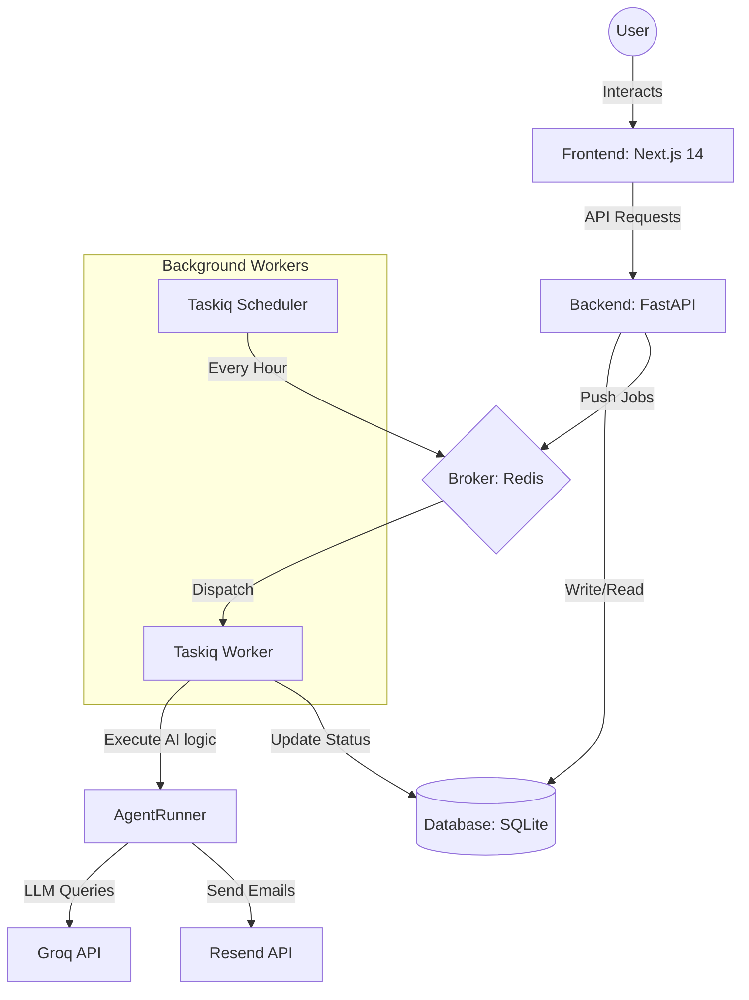

# FollowUpAI Developer Guide

Welcome to the professional engineering guide for **FollowUpAI**. This document provides a deep dive into the architecture, state management, and maintenance of the system.

## 🏗️ Architecture Overview

FollowUpAI uses a **Hybrid Async Architecture** to ensure the UI remains responsive while the LLM processes heavy background tasks.



## 🛠️ Pro-Level Setup (From Scratch)

### 1. Environment & Infrastructure
Maintainability starts with separate environments. Use `.env` for secrets and never commit them.

*   **Redis**: Required for the task queue. 
    *   *Pro Tip*: If Docker fails on Windows, install **Memurai** (Redis for Windows) or use **WSL2**.
*   **Groq API**: High-speed LLM inference.
*   **Resend/Tavily**: For outgoing mail and web discovery.

### 2. Backend Engine
The backend is modularized into `agents/`, `models/`, and `routes/`.

```bash
# Verify virtual env is isolated
python -m venv venv
./venv/Scripts/activate

# Install with precise versions
pip install -r requirements.txt
```

### 3. Running the Worker Stack
A professional setup requires three terminal windows:
1.  **Web Server**: `python -m uvicorn main:app --reload`
2.  **Worker (The Muscles)**: `taskiq worker main:broker worker --workers 1`
3.  **Scheduler (The Brain)**: `taskiq scheduler tkq:scheduler`

## 🤖 Sequence Automation Logic
The system uses a custom `SequenceManager` that calculates "Next Action" states.
*   **Wait Logic**: Uses `(current_date - last_contacted_date) >= next_step.wait_days`.
*   **Fail-Safe**: If an action fails, the worker logs it in `ActivityLog` and keeps the lead in its current step for manual retry.

## 🔒 Security Best Practices
*   **Secrets**: All keys are moved to `backend/.env`. 
*   **Verification**: `config.py` uses Pydantic's `BaseSettings` to validate that required keys exist at startup.
*   **CORS**: Only allowed origins (localhost:3000-3002) can hit the API.

## 🚀 Pushing to GitHub (The Pro Way)
Follow these steps to ensure a clean commit history.

> [!WARNING]
> If you previously tried to push and were blocked by **GitHub Push Protection**, it means sensitive keys are in your local `.git` history. 
> 
> **To fix this "Pro-Style":**
> 1.  Delete the local `.git` folder (to start fresh): `rm -rf .git` (or `Remove-Item -Recurse -Force .git`)
2.  Re-initialize: `git init`
3.  Initial Commit: `git add .` then `git commit -m "initial: production-ready hybrid automation agent"`
4.  Add Remote: `git remote add origin YOUR_REPO_URL`
5.  Force Push: `git push -u origin main --force`

This completely removes the secret from your history so GitHub will accept the push.

1.  **Initialize**: `git init` (if not already done).
2.  **Ignore**: Ensure `.gitignore` includes `venv/`, `__pycache__/`, and `.env`.
3.  **Commits**: Use conventional commits (e.g., `feat: add sequence engine`, `fix: broker crash`).
4.  **Push**:
    ```bash
    git add .
    git commit -m "feat: implement hybrid automation engine and sequences"
    git branch -M main
    git remote add origin YOUR_REPO_URL
    git push -u origin main
    ```

## 🔍 Debugging
*   **Logs**: Check `backend/logs/` (if configured) or the worker terminal.
*   **Database**: Use a SQLite browser to inspect the `leads` and `sequences` tables.
*   **Task Status**: The frontend uses toast notifications to track background job initiation.
