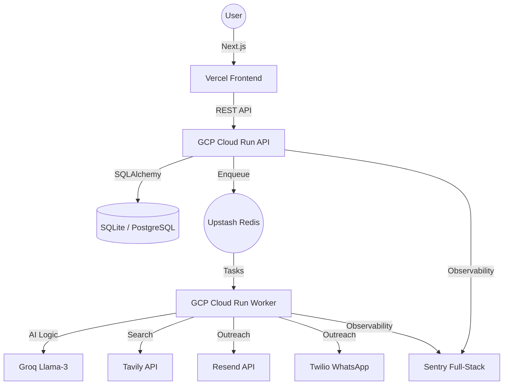

# 🛰️ FollowUpAI: Industry-Grade Sales Engineering

**FollowUpAI** is a high-performance, autonomous AI agent designed for lead discovery and multi-channel pipeline recovery. Built with an industry-grade stack, it combines strategic LLM orchestration with real-world communication APIs.

---

## 🏗️ System Architecture

---

## 🛠️ Performance Tech Stack

| Layer | Technology | Why? |
| :--- | :--- | :--- |
| **Frontend** | [Next.js 14+](https://nextjs.org/) | App Router, Server Components, and Vercel optimization. |
| **Backend** | [FastAPI](https://fastapi.tiangolo.com/) | Asynchronous, type-safe, and high-performance Python framework. |
| **Agent Logic** | [LangGraph](https://www.langchain.com/langgraph) | State-machine based AI orchestration for complex sales cycles. |
| **Task Queue** | [Taskiq](https://taskiq-python.github.io/) + [Upstash](https://upstash.com/) | Modern async task management with serverless Redis. |
| **Communication** | [Resend](https://resend.com/) & [Twilio](https://www.twilio.com/) | Verified providers for Email and WhatsApp (Sandbox/Pro). |
| **Intelligence** | [Groq](https://groq.com/) | Blazing fast LLM inference (Llama-3). |
| **Persistence** | [SQLite](https://sqlite.org/) / [Cloud SQL](https://cloud.google.com/sql) | Hybrid DB support for development and production. |

---

## 🚀 Getting Started (Hybrid Pro)

### Local Development
1. **Backend**: `cd backend && pip install -r requirements.txt && uvicorn main:app --reload`
2. **Worker**: `cd backend && taskiq worker worker:broker worker`
3. **Frontend**: `cd frontend && npm install && npm run dev`

### Production Deployment
Refer to the [**GCP Deployment Guide**](./GCP_DEPLOY.md) for instructions on containerizing and deploying to Google Cloud.

---

## 🛡️ Observability & Monitoring
- **Error Tracking**: Visit path `/sentry-example-page` to verify frontend reporting.
- **Traceability**: All requests are linked via Sentry Tracing IDs for end-to-end debugging.

---
*Created for Professional Software Engineering Portfolios.*
