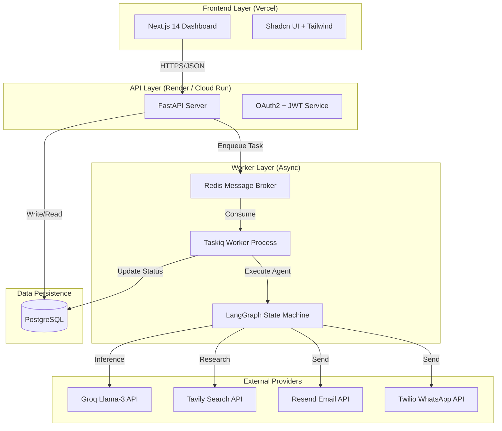

# 🦅 FollowUpAI: Autonomous Sales Recovery Agent

   

> **"Turn dead leads into revenue with autonomous, multi-channel engagement."**

**FollowUpAI** is an enterprise-grade autonomous agent system designed to automate the most painful part of sales: **The Follow-Up**. It intelligently orchestrates communication across Email and WhatsApp, using state-of-the-art LLMs (Llama-3 via Groq) to personalize content, detect intent, and recover stalled pipelines without human intervention.

---

## 📖 Table of Contents
- [🦅 FollowUpAI: Autonomous Sales Recovery Agent](#-followupai-autonomous-sales-recovery-agent)
  - [📖 Table of Contents](#-table-of-contents)
  - [🚀 The Problem \& Solution](#-the-problem--solution)
  - [🏗️ System Architecture](#-system-architecture)
  - [🛠️ Tech Stack \& Decisions](#-tech-stack--decisions)
  - [⚡ Key Features](#-key-features)
  - [🔧 Getting Started (Local)](#-getting-started-local)
  - [☁️ Deployment (Cloud)](#-deployment-cloud)
  - [🧠 AI Logic (The Brain)](#-ai-logic-the-brain)
  - [📂 Project Structure](#-project-structure)
  - [🛣️ Roadmap](#-roadmap)

---

## 🚀 The Problem & Solution

### The Pain 📉
Sales teams lose **48%** of leads simply because they don't follow up enough. Manual follow-ups are tedious, unpersonalized, and hard to scale. Leads go "cold" and revenue is left on the table.

### The Solution 📈
**FollowUpAI** acts as a tireless SDR (Sales Development Representative).
1.  **Ingests Leads**: Takes in leads from CSVs or CRM integrations.
2.  **Analyzes Context**: Uses AI to research the prospect (via Tavily) and understand their potential needs.
3.  **Autonomous Outreach**: Sends personalized emails (Resend) and WhatsApp messages (Twilio) based on a strategic cadence.
4.  **Handling Replies**: If a lead replies, the AI analyzes the sentiment (Interested, Not Interested, OOO) and updates the pipeline status automatically.

---

## 🏗️ System Architecture

The application follows a **Micro-Service Ready** architecture, separating the API layer from the background worker layer to ensure scalability and fault tolerance.



---

## 🛠️ Tech Stack & Decisions

We chose "Boring Technology" for infrastructure and "Bleeding Edge" for AI.

| Component | Technology | Why We Chose It |
| :--- | :--- | :--- |
| **Backend** | **FastAPI** | Python offers the best AI ecosystem. FastAPI provides async concurrency and auto-generated docs. |
| **Frontend** | **Next.js 14** | React Server Components for performance; standard for modern web apps. |
| **Database** | **PostgreSQL** | Relational data integrity is critical for CRM data. (Neon Tech for Serverless). |
| **Queue** | **Redis + Taskiq** | Decouples heavy AI processing from the specialized user-facing API. |
| **AI Model** | **Llama-3 (Groq)** | Near-instant inference speed (~800 t/s) is crucial for real-time agent loops. |
| **Orchestration** | **LangGraph** | Provides cyclic graph capability (Loops) which standard RAG chains lack. |

---

## ⚡ Key Features

*   **🔐 Secure Auth**: Complete User Management with JWT and SHA-256 Hashing.
*   **📊 Interactive Dashboard**: Real-time stats on Active Leads, Recovery Rate, and Agent Activity.
*   **🤖 Custom Agents**: Define different "Personalities" (e.g., Aggressive Closer, Helpful Consultant).
*   **🕸️ Deep Research**: The agent searches the web for the company before drafting the first message.
*   **📱 Multi-Channel**: Seamlessly switches between Email and WhatsApp to find the lead.
*   **🔄 Automatic Retry**: "Backoff" strategies for failed API calls or rate limits.

---

## 🔧 Getting Started (Local)

### Prerequisites
*   Node.js 18+
*   Python 3.10+
*   Docker (Optional, for easy DB setup)

### 1. Clone & Configure
```bash
git clone https://github.com/Aisenh037/FollowUpAI.git
cd FollowUpAI
```

### 2. Backend Setup
```bash
cd backend
python -m venv venv
# Windows
.\venv\Scripts\activate
# Mac/Linux
source venv/bin/activate

pip install -r requirements.txt
cp .env.example .env
# Edit .env with your API Keys (Groq, Resend, etc.)
```

### 3. Frontend Setup
```bash
cd frontend
npm install
cp .env.example .env.local
npm run dev
```

Visit `http://localhost:3000` to see the app!

---

## ☁️ Deployment (Cloud)

This project is optimized for "Serverless" Deployment.

*   **Frontend**: Deployed on **Vercel** with zero-config.
*   **Backend**: Deployed on **Render** (or Railway) using the included `DB-Less` Blueprint.
*   **Database**: Uses **Neon** (Serverless Postgres) and **Upstash** (Serverless Redis).

See [RENDER_VERCEL_DEPLOY.md](./RENDER_VERCEL_DEPLOY.md) for the step-by-step guide.

---

## 🧠 AI Logic (The Brain)

The core logic resides in `backend/agents`. We use a **State Graph**:

1.  **State**: `LeadStatus` (New, Researching, Contacted, Waiting, Replied).
2.  **Nodes**: Python functions that perform work (e.g., `research_lead`, `draft_email`).
3.  **Edges**: Conditional logic (e.g., `if reply_received -> stop_sequence`).

This determinism ensures the AI never goes "rogue" and always follows business rules.

---

## 📂 Project Structure

```text
FollowUpAI/
├── backend/
│   ├── agents/           # LangGraph Agent Logic
│   ├── routes/           # FastAPI Endpoints
│   ├── services/         # Business Logic (Email, DB)
│   ├── models/           # SQLAlchemy Database Models
│   ├── main.py           # App Entrypoint
│   └── worker.py         # Taskiq Worker Entrypoint
├── frontend/
│   ├── app/              # Next.js App Router Pages
│   ├── components/       # Reusable UI Components
│   ├── lib/              # API Clients & Utilities
│   └── types/            # TypeScript Interfaces
└── docker-compose.yml    # Local Dev Orchestration
```

---

## 🛣️ Roadmap
- [ ] **Voice Agent**: Integrate Twilio Voice for outbound calls.
- [ ] **Calendar Integration**: Auto-book meetings on Google Calendar.
- [ ] **Vector Memory**: Store lead history in Vector DB for long-term context.

---

### 👨‍💻 Author
Built by **[Your Name]** as a demonstration of advanced AI Engineering.
